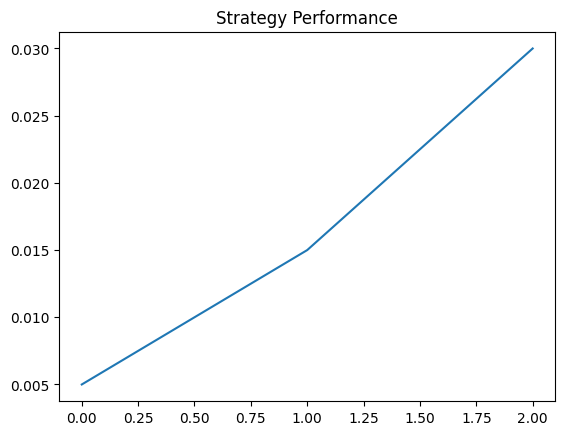

# Smart Beta Strategy with ML-Driven Risk Management  

## Overview  
A systematic strategy combining momentum/reversion signals, LSTM volatility prediction, and Markowitz optimization.  

## Features  
- Momentum & mean-reversion alpha signals  
- LSTM for volatility forecasting  
- Efficient Frontier portfolio optimization  
- Risk-adjusted metrics  

## Installation  
```bash  
git clone https://github.com/JuhiGola21/smart-beta-strategy-ml  
pip install -r requirements.txt


